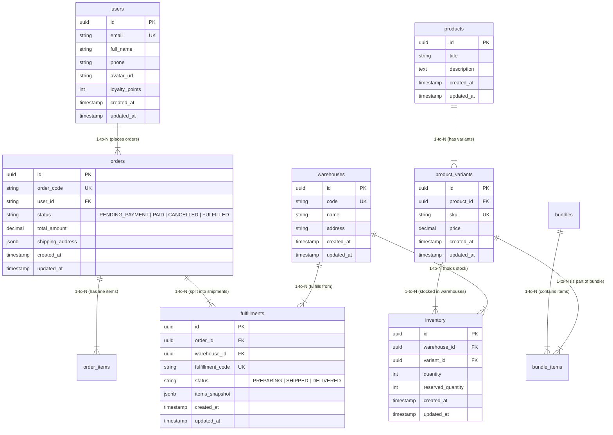
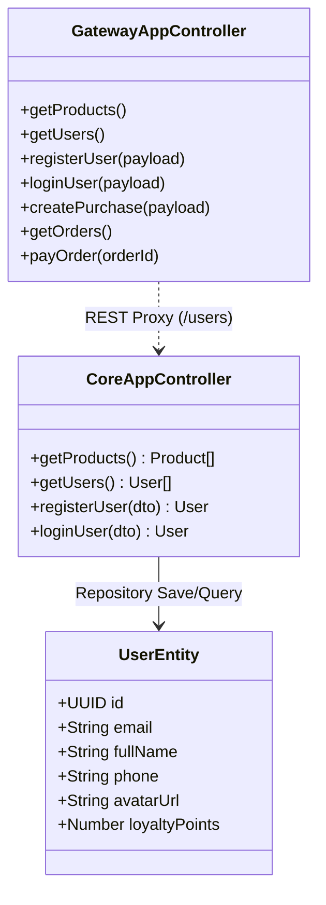

# Tài Liệu Rà Soát & Đặc Tả Thiết Kế Kiến Trúc (Diagram Specification & Architectural Review)

- **Hệ thống:** Omnidrop - Multiwarehouse Smart Order Routing & Flash Sale Engine
- **Ngày cập nhật:** 23/07/2026
- **Tác giả:** System Architect & Lead Engineer

---

## I. Tổng Quan Đánh Giá Thiết Kế Thực Thể & Cơ Sở Dữ Liệu

Sau khi rà soát toàn bộ cấu trúc mã nguồn backend (`apps/core-service`, `apps/order-routing-service`, `apps/flash-sale-service`) và hệ thống cơ sở dữ liệu PostgreSQL + Redis, hệ thống đã bổ sung **Thực thể Khách hàng (`core.users`)** lưu trữ bền vững thông tin tài khoản người mua hàng trên PostgreSQL.

### 1. Điểm Mạnh Kiến Trúc Đã Đạt Được:
1. **Quản lý Khách Hàng Lưu Trữ Bền Vững (`core.users`)**:
   - Lưu vết thông tin người mua: `id` (UUID), `email`, `full_name`, `phone`, `avatar_url`, `loyalty_points`.
2. **Phân tách Schema Độc Lập (`core` và `order`)**:
   - `core` schema: Chứa Khách hàng (`users`), Quản lý Sản phẩm (`products`), Biến thể (`product_variants`), Kho hàng (`warehouses`), Tồn kho vật lý (`inventory`), Combo (`bundles`).
   - `order` schema: Chứa Đơn hàng (`orders`), Chi tiết mặt hàng (`order_items`), Vận đơn điều phối kho (`fulfillments`).
3. **Bảo toàn dữ liệu tồn kho bằng công thức $Q_{ATS} = Q_{Physical} - Q_{Reserved}$**:
   - `inventory` table lưu vết tách biệt giữa `quantity` (tồn thực trên kệ) và `reserved_quantity` (đang giữ chỗ).

---

## II. Sơ Đồ Thực Thể & Cơ Sở Dữ Liệu (Database ERD Diagram)

---

## III. Sơ Đồ Lớp Kiến Trúc (Class Diagram)

