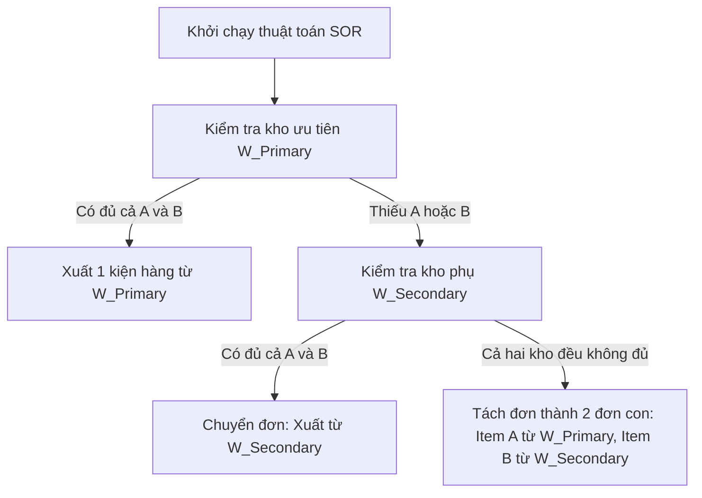

# Tài liệu đặc tả yêu cầu nghiệp vụ & kỹ thuật chi tiết (System PRD)

- **Dự án:** Hệ thống E-commerce Thương hiệu Omni tích hợp Flash Sale & Điều phối đa kho
- **Đối tác khách hàng:** Anh Thành – Founder chuỗi bán lẻ phụ kiện & thời trang Omni
- **Tác giả:** Kỹ sư trưởng (Lead Full-stack Developer / System Architect)
- **Trạng thái:** Sẵn sàng triển khai (Ready for Scaffolding)

---

## I. Tổng quan dự án & mục tiêu chiến lược

### 1. Bối cảnh Kinh doanh & Tầm nhìn Thương hiệu Omni

Khách hàng (Thành Founder) đang vận hành hệ thống bán lẻ phụ kiện & thời trang tăng trưởng nhanh trên các nền tảng trung gian (Shopee, Lazada, TikTok Shop, Facebook). Để tối ưu biên lợi nhuận, sở hữu tệp dữ liệu khách hàng (*First-party Data*) và chủ động tạo ra các chiến dịch bán hàng "đột biến doanh thu", thương hiệu quyết định xây dựng hệ thống Website độc lập Omni từ con số $0$.

### 2. Mục tiêu Kỹ thuật & Chỉ số SLA Tối thượng cho Hệ thống Omni

- **Khả năng chịu tải (Scalability & High Availability):** Hệ thống Omni phải duy trì trạng thái hoạt động bình thường, không gián đoạn (Uptime $\ge 99.9\%$) dưới áp lực giật tải đột biến khi mở bán các bộ sưu tập giới hạn hoặc chương trình Flash Sale.
  - *Target load:* $5.000$ đến $10.000$ người dùng đồng thời truy cập (*Active Users*) trong cùng một giây.
  - *Target throughput:* $\ge 2.000$ đơn hàng xử lý thành công trên phút (*Order Per Minute - OPM*).
- **Tốc độ phản hồi (Performance):**
  - *Trang chủ và xem chi tiết sản phẩm Omni:* Tốc độ tải trang dưới $2$ giây (First Contentful Paint - FCP $\le 1.2$ giây).
  - *API đặt hàng (Checkout):* Phản hồi dưới $< 500$ miligiây ở tải thường và dưới $< 1500$ miligiây dưới tải cực đỉnh (*Peak Load*).
- **Chống quá bán tuyệt đối (Anti-overselling Integrity):** Đảm bảo tính toàn vẹn dữ liệu tồn kho của Omni. Tổng số lượng đơn hàng thanh toán thành công ($Order_{Success}$) và đơn hàng đang giữ chỗ ($Order_{Reserved}$) tại mọi thời điểm không được vượt quá số lượng tồn kho vật lý khả dụng ($PhysicalStock$).
- **Điều phối tự động (Smart Logistics - SOR):** Giảm tỷ lệ xử lý đơn hàng bằng tay xuống dưới $< 5\%$, tự động phân tách và gán đơn hàng vào các kho vật lý tối ưu nhất dựa trên vị trí địa lý của khách hàng Omni và tình trạng sẵn có của hàng hóa.

---

## II. Quy định tồn kho & mô hình hóa dữ liệu đa kho Omni

Hệ thống Omni quản lý chuỗi cung ứng dựa trên mô hình phân tán hai kho vật lý độc lập:
- **Kho Miền Bắc (`KHO_HN`):** Phục vụ khu vực phía Bắc (Tính từ Vĩ tuyến 16 trở ra - từ Đà Nẵng trở ra Bắc).
- **Kho Miền Nam (`KHO_HCM`):** Phục vụ khu vực phía Nam (Tính từ Quảng Nam trở vào Nam).

### 1. Công thức Toán học Quản lý Tồn kho

Với mỗi Biến thể sản phẩm (SKU) tại một kho hàng vật lý cụ thể ($W$), trạng thái tồn kho được định nghĩa qua các biến số sau:
- $Q_{Physical}$ (*Physical Quantity*): Số lượng sản phẩm thực tế đang nằm trên kệ kho.
- $Q_{Reserved}$ (*Reserved Quantity*): Số lượng sản phẩm đang bị tạm giữ khi khách hàng nhấn thanh toán trực tuyến trên Omni nhưng chưa hoàn tất giao dịch. Thời gian giữ chỗ mặc định là $T_{expire} = 5$ phút.
- $Q_{ATS}$ (*Available To Sell*): Số lượng sản phẩm thực tế hiển thị trên web Omni cho phép khách hàng đặt mua.

Công thức tính tồn kho khả dụng:
$$Q_{ATS} = Q_{Physical} - Q_{Reserved}$$

### 2. Quy tắc tính Tồn kho cho sản phẩm Combo (Virtual Bundle)

Sản phẩm Combo ($B$) của Omni không có tồn kho vật lý độc lập. Nó được định nghĩa bởi một danh sách các sản phẩm thành phần lẻ $C_i$ với số lượng tương ứng $q_i$.
$$B = \{(C_1, q_1), (C_2, q_2), \dots, (C_n, q_n)\}$$

Tồn kho khả dụng của Combo ($Q_{ATS\_Bundle}$) được tính toán theo thời gian thực dựa trên công thức chặn dưới (Hàm Minimum):
$$Q_{ATS\_Bundle} = \min_{i=1}^{n} \left( \left\lfloor \frac{Q_{ATS}(C_i)}{q_i} \right\rfloor \right)$$

*Ví dụ:* Combo $B$ gồm $1$ Kính ($C_1$, hiện còn $10$ cái) và $1$ Bao da ($C_2$, hiện còn $4$ cái).
$$Q_{ATS\_Bundle} = \min \left( \left\lfloor \frac{10}{1} \right\rfloor, \left\lfloor \frac{4}{1} \right\rfloor \right) = \min(10, 4) = 4 \text{ (Combo khả dụng trên website Omni)}$$

---

## III. Yêu cầu tính năng chi tiết (Functional Requirements)

### A. Giao diện Khách hàng (Omni Customer-Facing Website & Mobile)

#### 1. Mô-đun Trang chủ & Danh mục Sản phẩm Omni
- **Cơ chế Cache tĩnh:** Trang danh mục và trang chi tiết sản phẩm thông thường phải được build tĩnh bằng cơ chế Incremental Static Regeneration (ISR) với thời gian revalidate là $60$ giây để tối đa tốc độ tải trang.
- **Hiển thị Biến thể:** Cho phép khách hàng chọn linh hoạt các thuộc tính (Color, Size) của sản phẩm. Khi click chọn, hệ thống tự động đổi URL và hiển thị đúng SKU tương ứng, đồng thời cập nhật trạng thái "Còn hàng" hoặc "Hết hàng".

#### 2. Mô-đun Trang Flash Sale Biệt lập (High-Concurrency Landing Page)
- **Đồng hồ đếm ngược (Countdown Timer):**
  - Hệ thống đồng bộ thời gian từ server Omni về client bằng giao thức NTP định kỳ để tránh việc khách hàng chỉnh giờ trên máy tính cá nhân nhằm kích hoạt nút mua sớm.
  - Nút "Mua Ngay" bị vô hiệu hóa (Disable) và hiển thị đếm ngược $T_{start} - T_{current}$.
  - Khi $T_{current} \ge T_{start}$, nút tự động chuyển sang trạng thái Active không cần tải lại trang.
- **Cập nhật tồn kho Real-time (Live Stock):**
  - Thiết lập kết nối Server-Sent Events (SSE) hoặc WebSockets từ API Gateway xuống trình duyệt khách hàng.
  - Khi tồn kho trên Redis giảm xuống, hệ thống đẩy sự kiện (Event Push) lượng tồn kho thực tế còn lại về giao diện Omni để tạo hiệu ứng tâm lý (FOMO). Lượng tồn kho hiển thị dạng: "Chỉ còn lại $X$ sản phẩm!".

#### 3. Mô-đun Giỏ hàng & Thanh toán (Checkout)
- **Tính phí vận chuyển tự động:** Khi khách hàng chọn Tỉnh/Thành, Quận/Huyện, hệ thống Omni gọi API của đơn vị vận chuyển đối tác (GHTK / GHN) để lấy bảng giá ship thời gian thực dựa trên tổng trọng lượng của các SKU trong giỏ hàng.
- **Tích hợp cổng thanh toán trực tuyến:** Tích hợp thanh toán QR Code ngân hàng (VietQR / PayOS) hoặc Ví điện tử (Momo / ZaloPay).
- **Cơ chế Webhook bảo mật:** Cổng thanh toán phải gọi về endpoint Webhook của Omni API Gateway với mã chữ ký số (Signature MD5/SHA256) để xác nhận giao dịch. Tuyệt đối không cập nhật trạng thái đơn hàng chỉ dựa trên phản hồi trực tiếp từ giao diện Client (Front-end).

---

### B. Giao diện Quản trị Omni (Omni Admin Dashboard)

#### 1. Màn hình Cấu hình Sản phẩm & Combo
- Admin có thể định nghĩa sản phẩm Omni, tạo các biến thể SKU, gán giá tiền riêng cho từng biến thể.
- Admin có thể tạo Combo bằng cách chọn các sản phẩm lẻ có sẵn trong hệ thống Omni và thiết lập mức chiết khấu phần trăm (Ví dụ: Giảm $15\%$).

#### 2. Màn hình Quản lý Đa Kho (Multi-Warehouse Inventory Control)
- Hiển thị danh sách các kho vật lý của Omni. Cho phép nhân viên cập nhật số lượng tồn kho vật lý (*quantity*) của từng SKU độc lập tại từng kho.
- Hiển thị danh sách các đơn hàng đã bị giữ chỗ (*reserved_quantity*) kèm thời gian đếm ngược hết hạn (TTL).

#### 3. Cấu hình Chiến dịch Flash Sale
- Cho phép thiết lập chiến dịch với các trường thông tin:
  - `campaign_id` (UUID), `title` (String).
  - `sku` áp dụng, `original_price` (Giá gốc), `flash_sale_price` (Giá ưu đãi).
  - `limit_quantity` (Số lượng giới hạn mở bán).
  - `start_time`, `end_time` (Định dạng ISO 8601).

---

## IV. Luồng nghiệp vụ kỹ thuật cốt lõi (Core Backend Logic)

### Luồng 1: Omni Flash Sale Engine (Xử lý Đơn hàng Tốc độ cao)

Để đạt tốc độ xử lý hàng vạn request cùng lúc mà không làm sập Database PostgreSQL của Omni, luồng đi của dữ liệu phải tuân thủ nghiêm ngặt mô hình bộ đệm RAM dưới đây:

#### Giai đoạn 1: Lọc tải và Giữ chỗ trên Redis (Pre-shunting Phase)
Khi khách hàng bấm "Mua Ngay" trên trang Flash Sale của Omni, request được chuyển qua API Gateway đến thẳng Flash Sale Engine. Engine chạy một đoạn Lua Script (Atomic Transaction) trên Redis để kiểm tra và trừ kho:

```lua
-- Lua Script chạy trên Redis của hệ thống Omni
local stock_key = KEYS[1] -- Key tồn kho: inventory:flash_sale:SKU_01
local limit_key = KEYS[2] -- Key giới hạn mua của user: user:limit:SKU_01:USER_01
local requested_qty = tonumber(ARGV[1])

-- 1. Kiểm tra giới hạn mua của khách hàng (Mỗi người chỉ được mua tối đa 1 sản phẩm)
local purchased = redis.call("GET", limit_key)
if purchased and tonumber(purchased) >= 1 then
    return -1 -- Mã lỗi: Vượt quá giới hạn mua cho phép trên Omni
end

-- 2. Kiểm tra tồn kho khả dụng
local current_stock = redis.call("GET", stock_key)
if not current_stock or tonumber(current_stock) < requested_qty then
    return -2 -- Mã lỗi: Hết hàng
end

-- 3. Trừ tồn kho và đánh dấu đã giữ chỗ
redis.call("DECRBY", stock_key, requested_qty)
redis.call("SET", limit_key, 1, "EX", 300) -- Giữ chỗ thông tin mua hàng trong 5 phút
return 1 -- Thành công
```

- Nếu Lua Script trả về mã lỗi ($-1$ hoặc $-2$), hệ thống lập tức trả về lỗi cho Front-end Omni (phản hồi trong vòng $< 10$ miligiây), không ghi log vào DB, không sinh tải lên DB.
- Nếu Lua Script trả về $1$ (Thành công), hệ thống sinh ra một *Reservation Token* có thời hạn sử dụng $300$ giây ($5$ phút).

#### Giai đoạn 2: Xử lý Bất đồng bộ với Message Queue (RabbitMQ)
- Sau khi giữ chỗ thành công trên Redis, Flash Sale Engine đóng gói dữ liệu đơn hàng và gửi một message sự kiện `order.created` vào hàng đợi RabbitMQ.
- Phản hồi lập tức về cho khách hàng: *"Đơn hàng của bạn đã được xếp hàng thành công, vui lòng hoàn tất thanh toán trong vòng 5 phút trên Omni."*
- Order & Routing Service (Phía sau Queue) sẽ tiêu thụ (*consume*) tin nhắn này, tạo bản ghi đơn hàng trong PostgreSQL của Omni với trạng thái `PENDING_PAYMENT`.

#### Giai đoạn 3: Saga Pattern bù trừ (Compensating Transaction)
- **Trường hợp 1 (Thanh toán thành công):** Cổng thanh toán gọi Webhook &rarr; Order Service nhận event &rarr; Cập nhật trạng thái đơn hàng thành `PAID` &rarr; Bắn sự kiện cập nhật số lượng tồn kho vật lý thực tế giảm đi tương ứng trong PostgreSQL.
- **Trường hợp 2 (Quá hạn 5 phút không thanh toán):** Hệ thống có một Worker lắng nghe Event hết hạn (hoặc dùng RabbitMQ TTL / Dead Letter Exchange). Khi phát hiện đơn hàng quá $5$ phút chưa thanh toán trên Omni &rarr; Chạy giao dịch bù trừ:
  - Hủy đơn hàng trong PostgreSQL (`CANCELLED`).
  - Bắn sự kiện gọi sang Flash Sale Engine để cộng lại số lượng tồn kho trên Redis:
    ```redis
    INCRBY inventory:flash_sale:SKU_01 1
    DEL user:limit:SKU_01:USER_01
    ```

---

### Luồng 2: Điều phối kho vận thông minh (Smart Order Routing - SOR) cho Omni

Sau khi đơn hàng chuyển sang trạng thái hợp lệ (đã thanh toán hoặc COD đã xác nhận), thuật toán điều phối thông minh SOR sẽ chạy để gán đơn hàng vào các kho vật lý thích hợp.

#### Sơ đồ Ma trận Phân vùng Địa lý (Geographic Mapping)
Hệ thống tự động map Tỉnh/Thành của địa chỉ nhận hàng của khách hàng Omni thành 2 vùng lớn:
- **Region North:** Toàn bộ các tỉnh từ Đà Nẵng trở ra phía Bắc (Đà Nẵng, Thừa Thiên Huế, Quảng Trị, Hà Nội, Hải Phòng, v.v.). &rarr; Mặc định gán Kho ưu tiên $W_{Primary} = \text{KHO\_HN}$.
- **Region South:** Toàn bộ các tỉnh từ Quảng Nam trở vào phía Nam (Quảng Nam, Quảng Ngãi, TP.HCM, Bình Dương, Cần Thơ, v.v.). &rarr; Mặc định gán Kho ưu tiên $W_{Primary} = \text{KHO\_HCM}$.

#### Thuật toán Điều phối & Tách đơn (Routing Matrix Engine)

Giả sử Đơn hàng gồm danh sách các sản phẩm yêu cầu $O = \{(Item_A, q_A), (Item_B, q_B)\}$.
Gọi $W_{Primary}$ là kho được ưu tiên theo địa chỉ khách hàng Omni, và $W_{Secondary}$ là kho còn lại.



```text
                  [Khởi chạy thuật toán SOR]
                             │
                             ▼
              [Kiểm tra kho ưu tiên W_Primary]
                             │
        ┌────────────────────┴────────────────────┐
        ▼                                         ▼
[W_Primary CÓ ĐỦ cả A và B] [W_Primary THIẾU A hoặc B]
        │                                         │
        ▼                                         ▼
(Xuất 1 kiện hàng)                       [Kiểm tra W_Secondary]
(Từ kho W_Primary)                                │
                                ┌─────────────────┴─────────────────┐
                                ▼                                   ▼
                  [W_Secondary CÓ ĐỦ A và B]   [Cả hai kho đều không đủ]
                                │                                   │
                                ▼                                   ▼
                          (Chuyển đơn)                   (Tách đơn thành 2 kiện)
                     (Xuất từ W_Secondary)            (A từ kho này, B từ kho kia)
```

- **Trường hợp 1 (Tập trung tối ưu):** Nếu $W_{Primary}$ có đủ tồn kho cho cả $Item_A$ and $Item_B$:
  - *Action:* Gán toàn bộ đơn hàng cho $W_{Primary}$. Tạo $1$ Vận đơn (*Fulfillment*) trên hệ thống Omni.
- **Trường hợp 2 (Tối ưu đóng gói):** Nếu $W_{Primary}$ không đủ hàng, nhưng $W_{Secondary}$ có đủ cả $Item_A$ và $Item_B$:
  - *Action:* Chuyển hướng đơn hàng, gán toàn bộ cho $W_{Secondary}$. *Mục tiêu:* Gom về $1$ kiện duy nhất để giảm phí đóng gói và phí vận chuyển của khách (thay vì bắt khách trả tiền ship cho 2 nơi).
- **Trường hợp 3 (Bắt buộc tách đơn - Split Order):** Nếu không kho nào có đủ cả 2 mặt hàng, nhưng Kho HN có $Item_A$ và Kho HCM có $Item_B$:
  - *Action:* Hệ thống tự động phân tách đơn hàng lớn thành $2$ Đơn hàng con (*Sub-orders*) độc lập trên Omni:
    - `Sub_Order_01`: Xuất hàng $Item_A$ từ $\text{KHO\_HN}$.
    - `Sub_Order_02`: Xuất hàng $Item_B$ từ $\text{KHO\_HCM}$.
  - *Notification:* Gửi thông báo đến Admin Omni: *"Đơn hàng #ID được tách tự động thành 2 kiện do giới hạn tồn kho phân tán"*.

---

## V. Tiêu chuẩn kỹ thuật & kiểm thử (Non-Functional Specifications)

### 1. Kiến trúc Giao tiếp giữa các Microservices (Event & gRPC Schemas)

#### Schema Event `order.created` (Gửi qua RabbitMQ Exchange của Omni)
```json
{
  "event_id": "8c4d1685-79a8-44fb-9cf9-fbdf3b2c9df7",
  "event_type": "ORDER_CREATED",
  "timestamp": "2026-07-17T02:25:21Z",
  "data": {
    "order_id": "ORD-20260717-99120",
    "user_id": "usr_99210",
    "delivery_address": {
      "province": "Hanoi",
      "district": "Cau Giay",
      "detail_address": "8 Tôn Thất Thuyết"
    },
    "items": [
      {
        "sku": "KINH-X-DEN-SIZE-M",
        "quantity": 1,
        "price": 425000.00
      }
    ],
    "payment_method": "ONLINE_GATEWAY",
    "reservation_token": "token_res_abc123xyz"
  }
}
```

#### gRPC Contract: `InventoryService.CheckStock` (Giao tiếp đồng bộ độ trễ thấp)
```protobuf
syntax = "proto3";

package inventory;

service InventoryService {
    rpc CheckStock (StockRequest) returns (StockResponse);
}

message StockRequest {
    string sku = 1;
    string warehouse_code = 2;
}

message StockResponse {
    string sku = 1;
    int32 available_to_sell = 2;
    bool is_in_stock = 3;
}
```

### 2. Kịch bản Kiểm thử chịu tải (Load Testing Specs cho Omni)

Để chứng minh hệ thống Omni hoạt động ổn định trước khi bàn giao cho anh Thành, quy trình kiểm thử tải (*Load Test*) bắt buộc phải sử dụng công cụ Locust hoặc k6 chạy trên hạ tầng giả lập độc lập:
- **Cấu hình tải giả lập:**
  - *Ramp-up:* Tăng dần từ $0$ lên $5.000$ Virtual Users (VUs) trong vòng $60$ giây.
  - *Steady state:* Duy trì ổn định ở mức $5.000$ VUs liên tục trong $10$ phút.
  - *Spike:* Đột ngột đẩy tải lên $10.000$ VUs trong vòng $10$ giây để giả lập khoảnh khắc đúng 00:00 của chiến dịch Flash Sale thương hiệu Omni.
- **Chỉ số đo lường vượt qua (Pass Criteria):**
  - Tỷ lệ phản hồi thành công (HTTP Status 200/201): $\ge 99.5\%$.
  - Tỷ lệ lỗi (HTTP Status 5xx/4xx trừ lỗi hết hàng): $< 0.5\%$.
  - Lượng bán quá mức (*Overselling*): Tuyệt đối bằng $0$.
- **Xác minh dữ liệu:** Sau khi kết thúc đợt test, kiểm tra Database PostgreSQL của Omni: Số lượng bản ghi đơn hàng ở trạng thái `PAID` và `PENDING_PAYMENT` cộng lại phải khớp chính xác đến từng đơn vị sản phẩm so với lượng tồn kho thực tế bị trừ.
